# Saku Backend — Architecture

## Overview

The backend is a **monolithic application (modular monolith)** built with **NestJS 11**, with **layered (Clean) architecture inside the core modules**.

- **One deploy unit**: a single NestJS process exposing a REST API (+ WebSocket gateway), backed by one database through a shared `PrismaService`.
- **Modular**: features live in self-contained NestJS modules under `src/modules/`, wired together by the dependency-injection container — modules communicate in-process via DI, never over the network.
- **Selective layering**: complex domains (`agent`, `task`, `schedule`) use a 4-layer Clean Architecture; simpler CRUD-ish modules (`auth`, `chat`, `user`, `social`, `health`, `dev`) use the flat controller → service pattern.

## High-Level Structure (Modular Monolith)

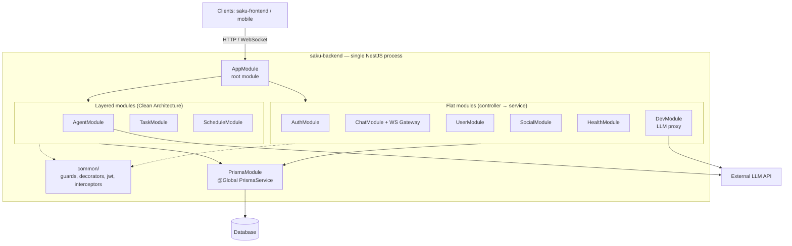

Key point: everything above runs in **one process with one database** — that is what makes it a monolith. The module boundaries are *code* boundaries, not deployment boundaries (no service mesh, no message broker, no per-service databases).

## Layered Architecture Inside Core Modules

`agent`, `task`, and `schedule` each follow the same 4-layer structure:

```
modules/<name>/
├── presentation/      → HTTP controllers, DTOs
├── application/       → services / use-cases, orchestration (e.g. agent tools)
├── domain/            → entities, repository interfaces (no framework deps)
└── infrastructure/    → Prisma repositories, LLM client, external services
```

### Dependency rule

Dependencies point inward — `domain` is the center and depends on nothing. `infrastructure` *implements* domain interfaces; it is wired to the application layer at runtime via NestJS injection tokens.

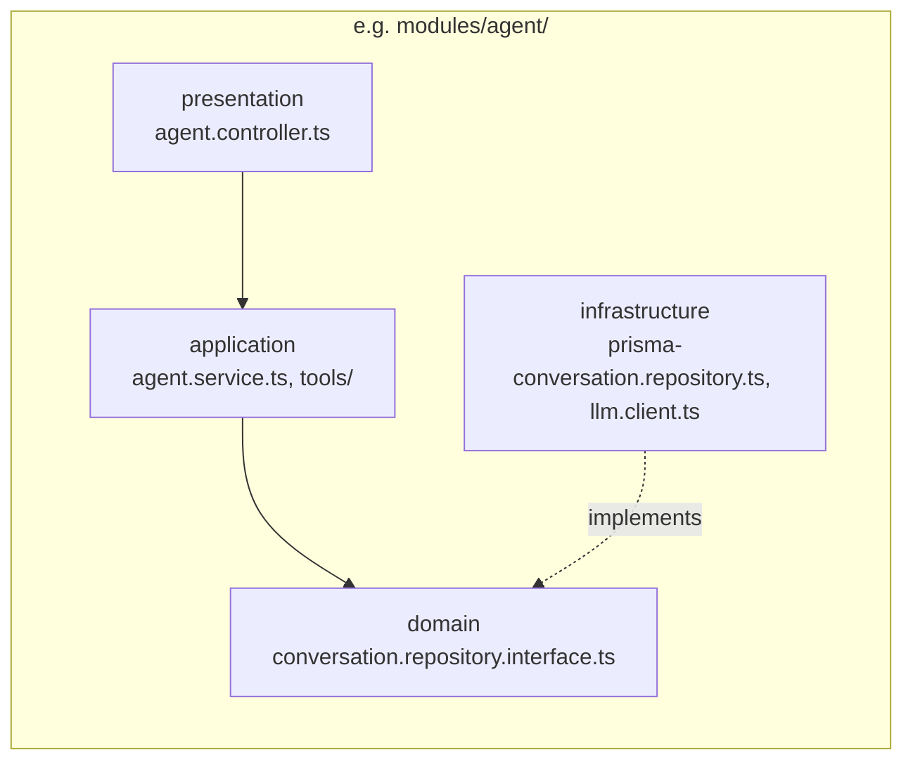

### Request flow example (Agent module)

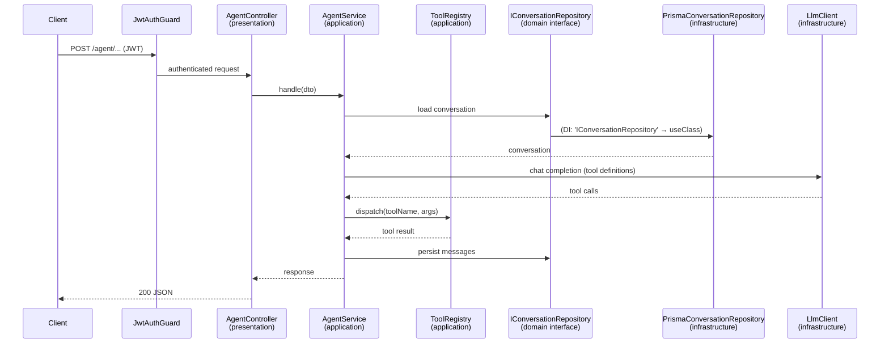

### Flat modules

`auth`, `chat`, `user`, `social` skip the layers — the controller calls a service that injects `PrismaService` directly:

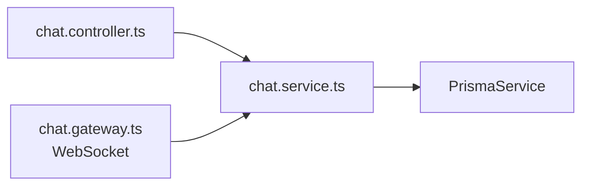

This is a deliberate trade-off: layers where the domain is complex, flat where it is mostly CRUD.

## Why Some Modules Are Layered and Some Are Flat

Layering has a cost, and it only pays off when a module carries real business rules. The split in this codebase follows that rule:

- **Layered** (`agent`, `task`, `schedule`) — these modules own genuine domain logic:
  - `agent`: LLM orchestration, tool dispatch, conversation state — many moving parts plus an external API.
  - `task`: a state machine (`complete()`, `start()`, `reset()`) with precondition checks (`canBeUpdated()`).
  - `schedule`: conflict detection and duration rules.
- **Flat** (`auth`, `chat`, `user`, `social`) — mostly CRUD and framework glue:
  - `chat`: receive message → save → broadcast. The logic is thin.
  - `auth`: validate credentials → issue JWT. Mostly delegation to libraries.
  - Adding layers here would mean four files passing data through while adding nothing.

### Benefits of layering

1. **Testability** — domain interfaces like `ITaskRepository` let you mock the repository and test business logic without a database. Testing a flat module requires mocking Prisma or running a test DB.
2. **Swappable infrastructure** — changing Prisma for another ORM, or switching LLM provider, only touches `infrastructure/`. The domain stays untouched.
3. **Business rules in one place** — `task.entity.ts` owns its state transitions; rules can't leak into controllers.
4. **Parallel work** — one developer can edit `presentation/` while another edits `infrastructure/` without collisions.

### Costs of layering

1. **File count ×3–4** — one endpoint means controller + DTO + use-case + interface + entity + repository implementation. Flat is two files.
2. **Indirection** — tracing a request takes four hops to find the logic. Slower onboarding for simple features.
3. **Boilerplate drift** — anemic pass-through layers (a service that only calls the repository) are pure ceremony.
4. **Premature abstraction** — an interface with exactly one implementation forever is dead weight (YAGNI).

### Should every module be layered?

It is possible, but not automatically worth it:

| Module | Layer it? | Why |
|---|---|---|
| `auth` | No | JWT issue/validate — no domain logic, layers would be ceremony |
| `user` | Borderline | If profile rules grow (plans, quotas), promote it later |
| `chat` | Borderline | If chat gains features (threads, reactions, moderation), promote it |
| `social` | Borderline | Same — depends on the roadmap |
| `health`, `dev` | Never | Infrastructure glue |

**Rule of thumb:** layer a module when it accumulates *invariants* — rules that must always hold — not by default. Migrating flat → layered later is cheap in NestJS because the module boundary already exists; the refactor stays inside one folder.

The counter-argument for layering everything is **consistency**: one pattern means fewer "which style goes here?" decisions and easier onboarding. Some teams accept the boilerplate for uniformity — a valid choice, but it taxes every CRUD endpoint.

**Current stance:** the split is intentional and correct. Watch `chat` — its realtime feature set is growing (presence, notifications, unread counts), making it the first candidate for promotion to the layered structure.

## Design Patterns Found in the Codebase

### Creational

| Pattern | Where | Evidence |
|---|---|---|
| **Singleton** | `src/prisma/prisma.service.ts:6` | `PrismaService` registered in a `@Global()` module; NestJS default provider scope = one instance per app, with `OnModuleInit`/`OnModuleDestroy` lifecycle hooks. |
| **Dependency Injection / IoC** | `src/modules/agent/agent.module.ts:24`, `src/modules/task/task.module.ts:16`, `src/modules/schedule/schedule.module.ts:12` | Injection tokens bind interfaces to implementations: `{ provide: 'IConversationRepository', useClass: PrismaConversationRepository }`. |

### Structural

| Pattern | Where | Evidence |
|---|---|---|
| **Repository** | `src/modules/*/domain/*.repository.interface.ts` + `src/modules/*/infrastructure/persistence/prisma-*.repository.ts` | `ITaskRepository`, `IScheduleRepository`, `IConversationRepository` interfaces in domain; Prisma implementations in infrastructure. Decouples domain from persistence. |
| **Adapter** | `src/modules/agent/infrastructure/llm/llm.client.ts:60` | Converts between interfaces: the app calls a typed `chat(messages, tools)` method; the adapter translates to/from the provider's HTTP/JSON wire format, mapping errors to `BadGatewayException`. |
| **Proxy** | `src/modules/dev/llm-proxy.controller.ts:48` | Protection proxy: exposes the *same* `/chat/completions` interface as the upstream provider, passes the body through unmodified, but adds access control (`assertProxyToken`, usage limits) and token metering (`LlmProxyUsageService`). |
| **Decorator** | `src/common/decorators/user.decorator.ts:15`, controllers | Custom `@CurrentUser()` param decorator; NestJS `@UseGuards`, `@Controller`, `@Injectable` decorators throughout. |

### Behavioral

| Pattern | Where | Evidence |
|---|---|---|
| **Registry** | `src/modules/agent/application/tools/tool-registry.ts:12` | `ToolRegistry` keeps a `handlers` map of tool name → handler fn and dispatches LLM tool calls by string lookup. |
| **Strategy** | `src/modules/agent/application/tools/task.tools.ts:14`, `schedule.tools.ts:24` | `TaskTools` and `ScheduleTools` are interchangeable tool providers — each exposes `definitions()` plus dispatch methods, plugged into the registry. |
| **Chain of Responsibility** | `src/app.module.ts:34` (global `LoggingInterceptor` via `APP_INTERCEPTOR`), `src/modules/agent/presentation/agent.controller.ts:27` (`@UseGuards(JwtAuthGuard)`) | Request passes through guard → interceptor (pre) → handler → interceptor (post); each link can short-circuit. |
| **Observer / Pub-Sub** | `src/modules/chat/chat.gateway.ts:31` | `ChatGateway` implements `OnGatewayConnection/Disconnect`; `@SubscribeMessage(...)` subscribes, `this.server.to(room).emit(...)` publishes presence/notification events to subscribed clients. |

Also worth noting: `task.entity.ts` and `schedule.entity.ts` are **rich domain entities** — state transitions (`complete()`, `start()`, `reset()`) guard their own preconditions (`canBeUpdated()`), keeping business rules in the domain layer rather than in services.

## Pattern Diagrams

How each pattern is wired in this codebase. Method names in class diagrams are illustrative — see the referenced files for exact signatures.

### Singleton — `PrismaService`

One instance per app lifecycle (NestJS default provider scope) exposed globally, so every consumer shares one database connection pool.

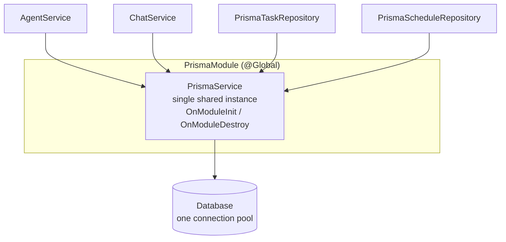

### Dependency Injection / IoC — injection tokens

Consumers depend on a string token; the module binds the token to a concrete class at composition time. Swapping the implementation is a one-line change in the module.

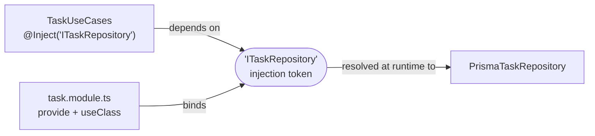

### Repository — domain interface, infrastructure implementation

The application layer only sees the interface; Prisma is invisible above the infrastructure layer. This is the dependency inversion that makes the core modules "clean" rather than classically layered.

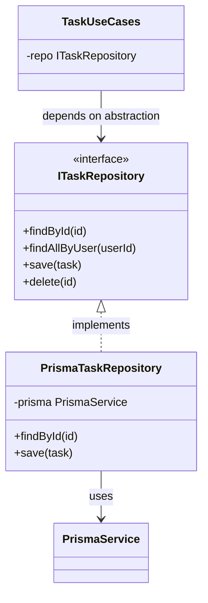

### Adapter — `LlmClient`

Converts between two incompatible interfaces: the application speaks a typed TypeScript method (`chat(messages, tools)`); the provider speaks HTTP/JSON. The adapter owns the translation (request shaping, response unwrapping, error mapping) so the rest of the app never touches the wire format.

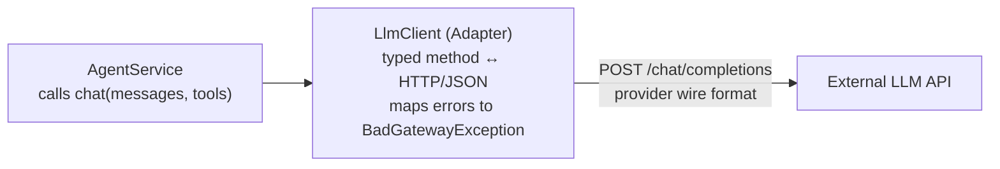

### Proxy — `LlmProxyController`

A *protection proxy*: it exposes the **same** `/chat/completions` interface as the upstream provider and passes the request body through unmodified — no interface conversion (that is what distinguishes it from an adapter). What it adds is access control and accounting.

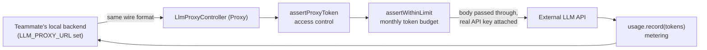

### Decorator — `@CurrentUser()` and the NestJS decorator stack

A custom param decorator extracts the authenticated user (placed on the request by `JwtAuthGuard`) and injects it straight into the handler signature.

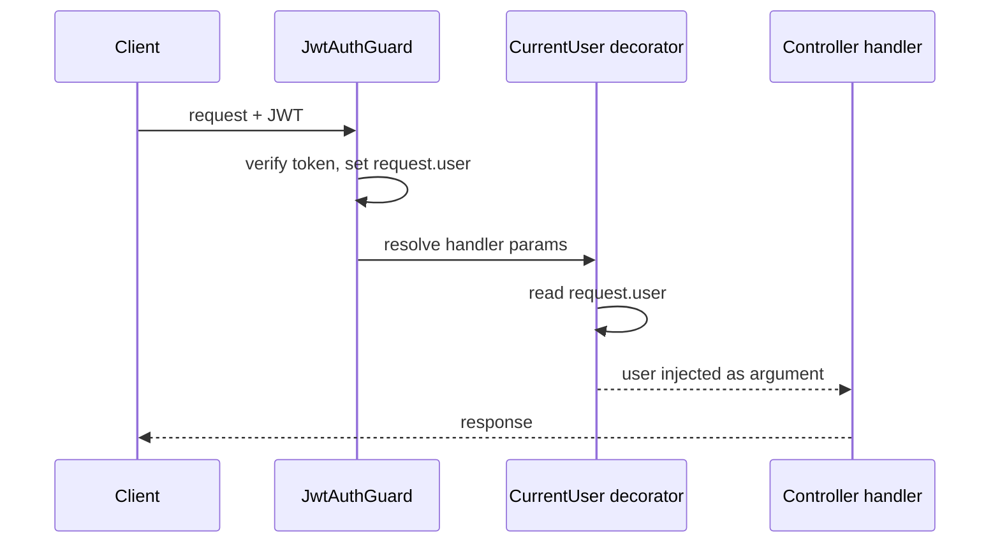

Structural view — decorators attach metadata and behavior to the handler without changing its code:

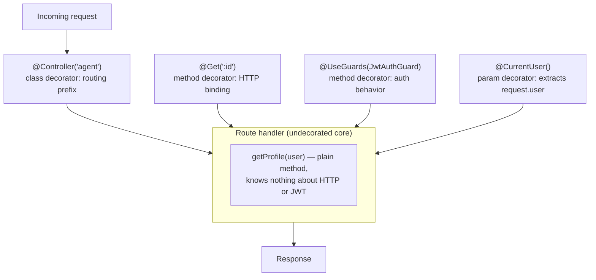

### Registry — `ToolRegistry`

A name → handler map. The LLM returns a tool call by string name; the registry dispatches it without the agent service knowing which class handles what.

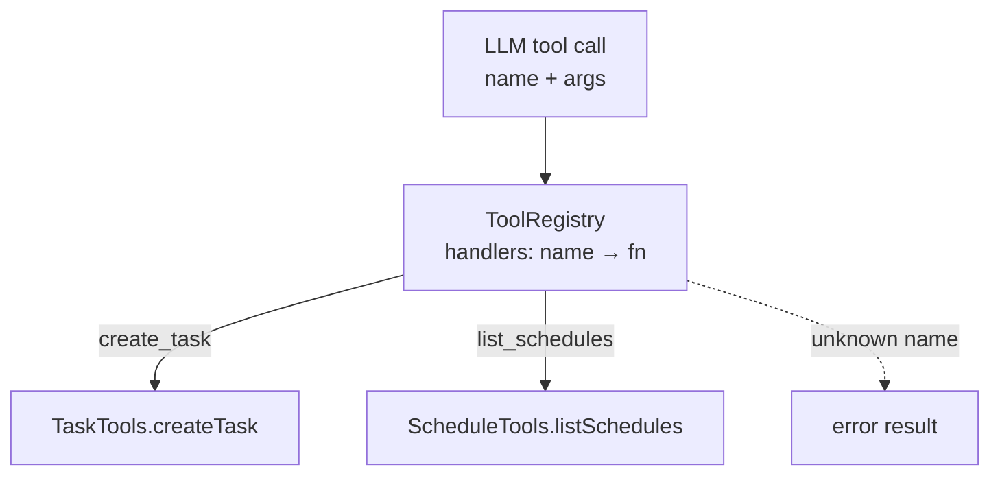

### Strategy — interchangeable tool providers

`TaskTools` and `ScheduleTools` share the same shape (a `definitions()` method plus handlers) and plug into the registry interchangeably. The contract is implicit (duck-typed) — adding a formal `ToolProvider` interface would make it explicit.

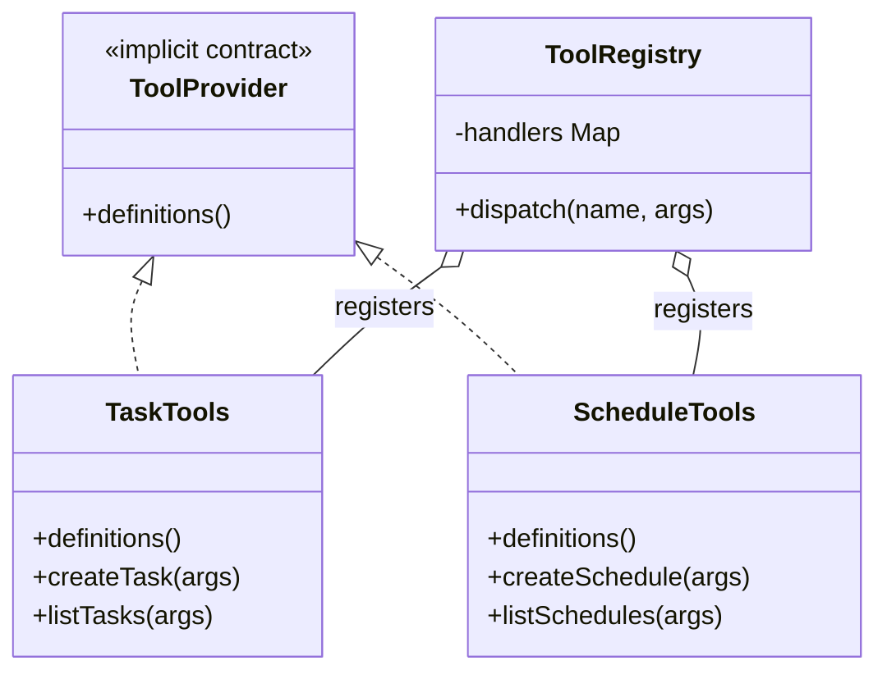

### Chain of Responsibility — guard → interceptor → handler pipeline

Each link can short-circuit the request (guard rejects with 401) or wrap it (interceptor logs before and after).

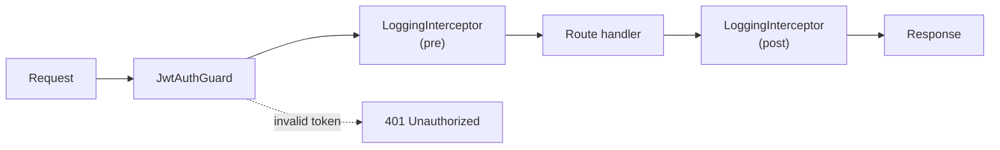

### Observer / Pub-Sub — `ChatGateway`

Clients subscribe by connecting and joining rooms; the gateway publishes messages, presence, and notification events to all subscribers of a room without senders knowing who receives.

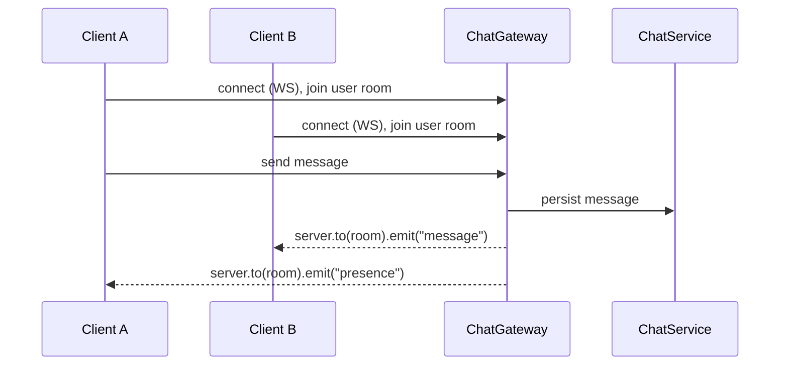

Structural view — the gateway is the subject, connected clients are observers grouped by room:

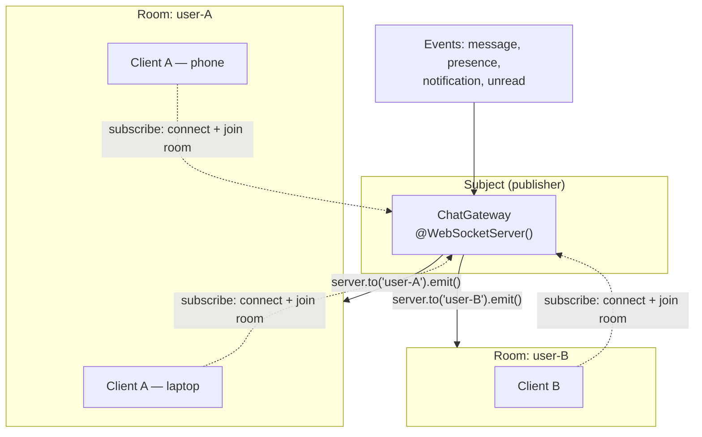

## Known Layering Violations

Tracked here so they don't get cargo-culted:

1. **Domain → infrastructure import (DIP violation)** — `src/modules/agent/domain/conversation.repository.interface.ts:1` imports `LlmToolCall` from `../infrastructure/llm/llm.client`. The type should be defined in the domain layer and re-used by infrastructure, not the other way around.
2. **Presentation → Prisma direct** — `src/modules/schedule/presentation/schedule.controller.ts:28` injects `PrismaService` directly, bypassing the use-case + repository layers used elsewhere in the module.

## Summary

| Question | Answer |
|---|---|
| System architecture | Monolithic (modular monolith) — single deployable, single DB |
| Module organization | NestJS feature modules + DI container |
| Internal architecture (core modules) | Layered / Clean Architecture (presentation → application → domain ← infrastructure) |
| Internal architecture (simple modules) | Flat controller → service → Prisma |
| Patterns in use | Singleton, DI/IoC, Repository, Adapter, Proxy, Decorator, Registry, Strategy, Chain of Responsibility, Observer/Pub-Sub |
