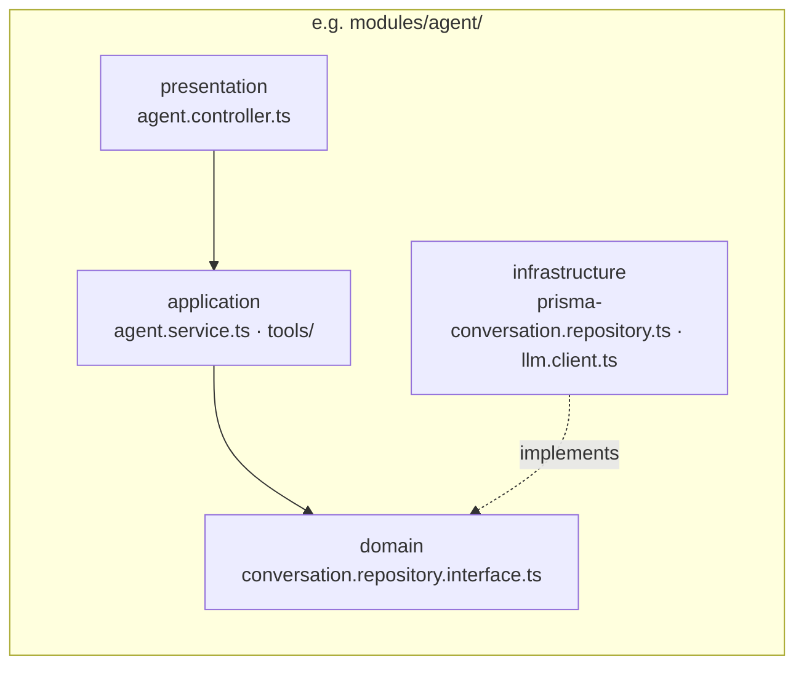
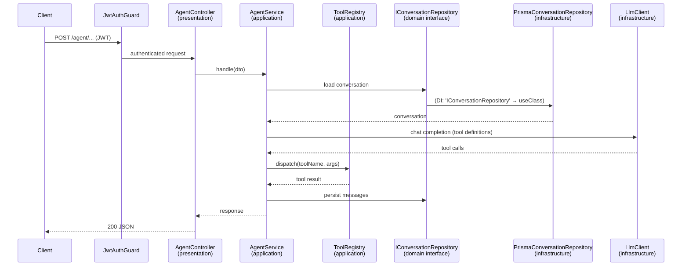
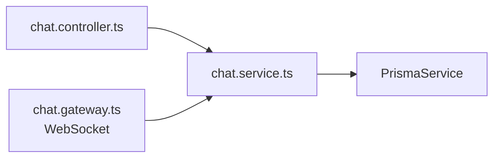

# Saku Backend — Architecture

## Overview

The backend is a **monolithic application (modular monolith)** built with **NestJS 11**, with **layered (Clean) architecture inside the core modules**.

- **One deploy unit**: a single NestJS process exposing a REST API (+ WebSocket gateway), backed by one database through a shared `PrismaService`.
- **Modular**: features live in self-contained NestJS modules under `src/modules/`, wired together by the dependency-injection container — modules communicate in-process via DI, never over the network.
- **Selective layering**: complex domains (`agent`, `task`, `schedule`) use a 4-layer Clean Architecture; simpler CRUD-ish modules (`auth`, `chat`, `user`, `social`, `health`, `dev`) use the flat controller → service pattern.

## High-Level Structure (Modular Monolith)

```mermaid
graph TB
    Client[Clients: saku-frontend / mobile]

    subgraph Monolith["saku-backend — single NestJS process"]
        AppModule[AppModule<br/>root module]

        subgraph Layered["Layered modules (Clean Architecture)"]
            Agent[AgentModule]
            Task[TaskModule]
            Schedule[ScheduleModule]
        end

        subgraph Flat["Flat modules (controller → service)"]
            Auth[AuthModule]
            Chat[ChatModule + WS Gateway]
            User[UserModule]
            Social[SocialModule]
            Health[HealthModule]
            Dev[DevModule<br/>LLM proxy]
        end

        Common[common/<br/>guards · decorators · jwt · interceptors]
        Prisma[PrismaModule<br/>@Global PrismaService]
    end

    DB[(Database)]
    LLM[External LLM API]

    Client -->|HTTP / WebSocket| AppModule
    AppModule --> Layered
    AppModule --> Flat
    Layered --> Prisma
    Flat --> Prisma
    Layered -.-> Common
    Flat -.-> Common
    Prisma --> DB
    Agent --> LLM
    Dev --> LLM
```

Key point: everything above runs in **one process with one database** — that is what makes it a monolith. The module boundaries are *code* boundaries, not deployment boundaries (no service mesh, no message broker, no per-service databases).

## Layered Architecture Inside Core Modules

`agent`, `task`, and `schedule` each follow the same 4-layer structure:

```
modules/<name>/
├── presentation/      → HTTP controllers, DTOs
├── application/       → services / use-cases, orchestration (e.g. agent tools)
├── domain/            → entities, repository interfaces (no framework deps)
└── infrastructure/    → Prisma repositories, LLM client, external services
```

### Dependency rule

Dependencies point inward — `domain` is the center and depends on nothing. `infrastructure` *implements* domain interfaces; it is wired to the application layer at runtime via NestJS injection tokens.



### Request flow example (Agent module)



### Flat modules

`auth`, `chat`, `user`, `social` skip the layers — the controller calls a service that injects `PrismaService` directly:



This is a deliberate trade-off: layers where the domain is complex, flat where it is mostly CRUD.

## Design Patterns Found in the Codebase

### Creational

| Pattern | Where | Evidence |
|---|---|---|
| **Singleton** | `src/prisma/prisma.service.ts:6` | `PrismaService` registered in a `@Global()` module; NestJS default provider scope = one instance per app, with `OnModuleInit`/`OnModuleDestroy` lifecycle hooks. |
| **Dependency Injection / IoC** | `src/modules/agent/agent.module.ts:24`, `src/modules/task/task.module.ts:16`, `src/modules/schedule/schedule.module.ts:12` | Injection tokens bind interfaces to implementations: `{ provide: 'IConversationRepository', useClass: PrismaConversationRepository }`. |

### Structural

| Pattern | Where | Evidence |
|---|---|---|
| **Repository** | `src/modules/*/domain/*.repository.interface.ts` + `src/modules/*/infrastructure/persistence/prisma-*.repository.ts` | `ITaskRepository`, `IScheduleRepository`, `IConversationRepository` interfaces in domain; Prisma implementations in infrastructure. Decouples domain from persistence. |
| **Adapter / Facade** | `src/modules/dev/llm-proxy.controller.ts:48`, `src/modules/agent/infrastructure/llm/llm.client.ts` | Wraps the external LLM provider API — swaps auth keys, adds token accounting (`LlmProxyUsageService`), and translates requests/responses behind a stable internal interface. |
| **Decorator** | `src/common/decorators/user.decorator.ts:15`, controllers | Custom `@CurrentUser()` param decorator; NestJS `@UseGuards`, `@Controller`, `@Injectable` decorators throughout. |

### Behavioral

| Pattern | Where | Evidence |
|---|---|---|
| **Registry** | `src/modules/agent/application/tools/tool-registry.ts:12` | `ToolRegistry` keeps a `handlers` map of tool name → handler fn and dispatches LLM tool calls by string lookup. |
| **Strategy** | `src/modules/agent/application/tools/task.tools.ts:14`, `schedule.tools.ts:24` | `TaskTools` and `ScheduleTools` are interchangeable tool providers — each exposes `definitions()` plus dispatch methods, plugged into the registry. |
| **Chain of Responsibility** | `src/app.module.ts:34` (global `LoggingInterceptor` via `APP_INTERCEPTOR`), `src/modules/agent/presentation/agent.controller.ts:27` (`@UseGuards(JwtAuthGuard)`) | Request passes through guard → interceptor (pre) → handler → interceptor (post); each link can short-circuit. |
| **Observer / Pub-Sub** | `src/modules/chat/chat.gateway.ts:31` | `ChatGateway` implements `OnGatewayConnection/Disconnect`; `@SubscribeMessage(...)` subscribes, `this.server.to(room).emit(...)` publishes presence/notification events to subscribed clients. |

Also worth noting: `task.entity.ts` and `schedule.entity.ts` are **rich domain entities** — state transitions (`complete()`, `start()`, `reset()`) guard their own preconditions (`canBeUpdated()`), keeping business rules in the domain layer rather than in services.

## Known Layering Violations

Tracked here so they don't get cargo-culted:

1. **Domain → infrastructure import (DIP violation)** — `src/modules/agent/domain/conversation.repository.interface.ts:1` imports `LlmToolCall` from `../infrastructure/llm/llm.client`. The type should be defined in the domain layer and re-used by infrastructure, not the other way around.
2. **Presentation → Prisma direct** — `src/modules/schedule/presentation/schedule.controller.ts:28` injects `PrismaService` directly, bypassing the use-case + repository layers used elsewhere in the module.

## Summary

| Question | Answer |
|---|---|
| System architecture | Monolithic (modular monolith) — single deployable, single DB |
| Module organization | NestJS feature modules + DI container |
| Internal architecture (core modules) | Layered / Clean Architecture (presentation → application → domain ← infrastructure) |
| Internal architecture (simple modules) | Flat controller → service → Prisma |
| Patterns in use | Singleton, DI/IoC, Repository, Adapter/Facade, Decorator, Registry, Strategy, Chain of Responsibility, Observer/Pub-Sub |
